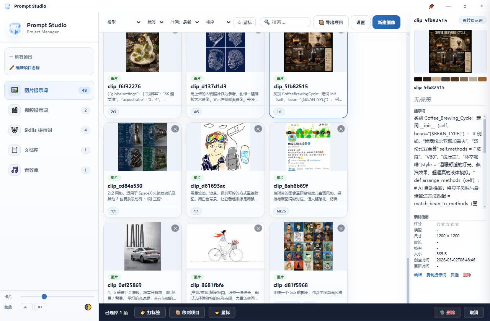
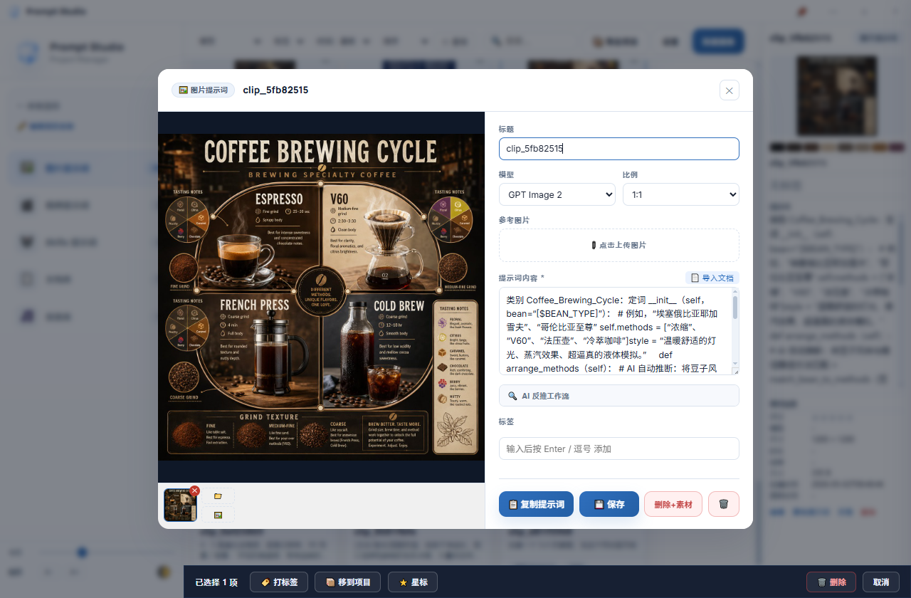
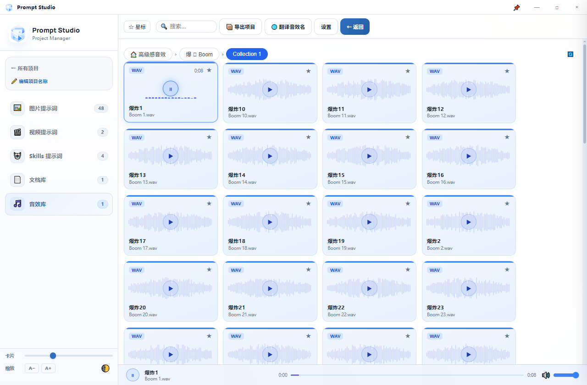
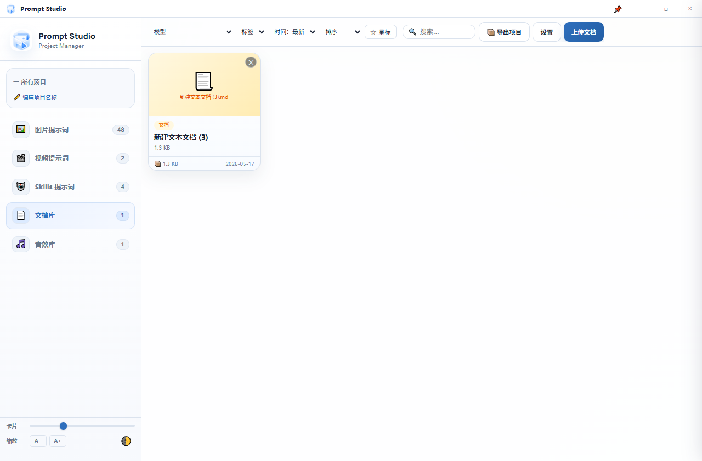
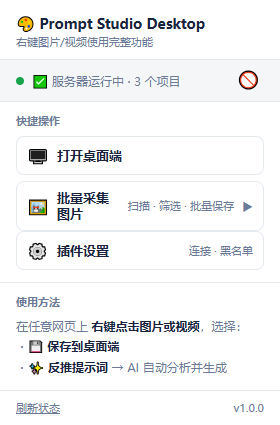

<div align="center">

# 🎨 Prompt Studio Desktop

**A local desktop app for managing AI image & video prompts — with a companion browser extension.**

[](https://github.com/xiaoyan1995/prompt-studio-desktop/releases)
[](https://github.com/xiaoyan1995/prompt-studio-desktop/actions/workflows/build.yml)
[](#build)
[](LICENSE)
[](https://www.electronjs.org/)

[English](README.md) · [中文说明](README_CN.md)

</div>

---

## 🖼️ Screenshots

<div align="center">

### Image Prompts · Card Grid + Live Inspector



<br><br>

### Prompt Detail & Multi-Image Gallery · Audio Library Waveform Preview

<table>
<tr>
<td align="center" width="50%">
  <br>
  <sub>📝 Prompt Detail — large preview · reference image · gallery strip · AI reverse-prompt</sub>
</td>
<td align="center" width="50%">
  <br>
  <sub>🎵 Audio Library — live waveform · folder browse · star · drag to DAW</sub>
</td>
</tr>
</table>

<br>

### Document Library · Browser Extension

<table>
<tr>
<td align="center" width="50%">
  <br>
  <sub>📚 Document Library — PDF / Word / Excel / PPT / Markdown multi-format preview</sub>
</td>
<td align="center" width="50%">
  <br>
  <sub>🌐 Browser Extension — send media from any page to the desktop app instantly</sub>
</td>
</tr>
</table>

</div>

---

## ✨ Features

- 📁 **Project-based organization** — group image & video prompts by project
- 🖼️ **Rich media support** — attach reference images and videos to each prompt
- 🤖 **Skills / Agent prompts** — full Markdown editor with preview
- 🔍 **Reverse prompt** — analyze uploaded media and auto-generate prompt text
- 🏷️ **Tags & search** — full-text search across titles, prompts, tags and analysis
- 📦 **Export bundles** — zip selected assets with metadata for sharing
- 💾 **Snapshot backup** — one-click local backup and restore
- 🔁 **Duplicate detection** — find identical or similar prompts across projects
- 🌐 **Browser extension** — floating toolbar on any page; send media to desktop instantly
- 📚 **Document library** — upload & preview PDF, Word, Excel, PPT, TXT, Markdown and more
- ⚡ **Prompt quick-insert** — shortcut icon next to any input field; one-click insert from your prompt library, with optional AI rewrite
- 🚫 **Domain blacklist** — per-site block list to hide the extension toolbar
- 🖼️ **Image gallery** — multiple generated images per prompt; click thumbnail to set as main
- 🔎 **Fullscreen lightbox** — click any image to view at full resolution
- 🔊 **Audio library** — link local audio folders; browse, preview, star, translate names with LLM, drag files to DAW or file manager
- 🌍 **Bilingual UI** — switch between Chinese and English in Settings; all UI text updates instantly, preference saved locally
- 🤝 **Agent / CLI integration** — full HTTP API for external agents to read & write prompts, push AI-generated images and videos, and query the audio library

## 📋 Changelog

### v1.1.4
- **Project card right-click menu** — right-click any project card to Open, Edit, Change Cover, or Delete without entering the project
- **Custom project cover** — upload any image, select from existing project images, or reset to auto (first image in project)
- **Inspector image zoom** — click the thumbnail in the inspector panel to open it in the full-screen lightbox
- **Window pin icon** — replaced emoji 📌 with an SVG outline icon; fixed the button appearing white when active in dark mode
- **Unified card heights** — all prompt cards are now the same height regardless of whether a model chip is present (invisible placeholder footer)
- **Model dropdown fix** — dropdown now shows "Not specified" instead of defaulting to GPT Image 2 when no model is stored; prevents misleading chip display
- **Accurate project counts** — card stats and inspector now exclude folder entries, matching the sidebar count
- **UI polish** — soft blue-white gradient background on project management page; dark mode sidebar border and active nav item refined

### v1.1.3
- **Browser extension — prompt quick-insert improvements**:
  - Icon positioned outside the input box (left edge), no text occlusion, auto-repositions on scroll/resize
  - Icon stays visible after focus — convenient for inserting multiple prompts in a row
  - Panel now uses a 2-column card grid with thumbnails + title + prompt excerpt
  - Folders shown as a directory tree in the sidebar instead of mixed into the card grid
  - New ✨ AI Rewrite: type a rewrite instruction then click a card — AI rewrites the prompt before inserting
  - Fixed contenteditable insertion failing on second click (selection range save/restore)
- **New API**: `/api/rewrite-prompt` — AI-powered prompt rewriting endpoint

### v1.1.2
- **Browser extension — prompt quick-insert**: shows a shortcut icon next to any input field on whitelisted sites; click to open prompt library panel and insert prompts with one click
- **Insert whitelist management**: toggle quick-insert per domain from the extension popup
- **Panel features**: search filter, project switching, category tabs (Image / Video / Skills)

### v1.1.1
- **Bilingual UI (CN / EN)**: language toggle added to Settings; all UI text — modals, labels, buttons, hints, placeholders — switches instantly between Chinese and English; preference persisted locally

### v1.1.0
- **Audio library**: link any local folder as an audio library per project; browse subfolders, preview WAV/MP3/FLAC/… with mini player (seek + volume), star favourites, translate filenames to Chinese with any LLM
- **Audio drag-out**: drag cards directly to a DAW or file manager using native OS drag — no HTML5 drag timing issues
- **Audio multi-select**: click to select, Ctrl+click to add, rubber-band on empty space to select multiple; batch-drag all selected files in one drop
- **Window pin (always-on-top)**: 📌 title-bar button keeps Prompt Studio floating above your DAW while browsing sound effects
- **Dedicated Text LLM settings**: separate API Base / Key / Model for audio-name translation (Settings → 文本 LLM) with connection test
- **Smarter translation**: 3 concurrent batches, cancel mid-run, auto `/v1` for LM Studio and other local LLMs
- **Agent audio API**: `GET /api/cli/audio/folders` and `GET /api/cli/audio/files` — agents can now list and stream audio files

### v1.0.8
- Image gallery strip — multiple generated images per prompt, click to select main
- Fullscreen lightbox — click main image to view at full resolution
- @ image picker — type `@` in prompt textarea to reference attached images
- Agent HTTP API — `/api/cli/*` endpoints for list / get / search / push
- `pstudio-cli.py` — CLI wrapper for agent integration
- `skills/prompt-studio/` — ready-to-use agent skill with full API reference
- Agents can push AI-generated images & videos via URL or base64
- Reference image and gallery images now stored separately (`ref_image` vs `gallery`)
- **Batch image collection** — scan, filter and batch-send page images to desktop; smart CDN cleanup for full-resolution URLs

### v1.0.7
- PDF / document library with multi-format preview
- Domain blacklist for browser extension
- Snapshot backup system
- Duplicate detection across projects

### v1.0.6
- Video prompt support with reference media grid
- Skills / Agent prompt type with full Markdown editor
- Reverse prompt analysis (AI-powered)

### v1.0.5
- Export bundles (zip assets + metadata)
- Smart folders with rule-based filtering
- Full-text search across all prompt fields

### v1.0.4
- Initial release
- Project-based organization
- Image prompt management with reference images
- Browser extension with floating toolbar

---

### 📦 Installation (No Build Required)

Download the latest distribution zip from [Releases](https://github.com/xiaoyan1995/prompt-studio-desktop/releases), unzip and run:

```
Prompt Studio Desktop/
├── Prompt Studio Desktop.exe   ← double-click to launch
├── studio-data/                ← your data lives here (auto-created)
└── extension/                  ← load this folder as a browser extension
```

**Load the browser extension:**
1. Open `chrome://extensions` (Chrome / Edge)
2. Enable **Developer mode**
3. Click **Load unpacked** → select the `extension/` folder

### 🛠️ Development

**Requirements:** Node.js 18+, Python 3.10+

```bash
# Clone
git clone https://github.com/xiaoyan1995/prompt-studio-desktop.git
cd prompt-studio-desktop

# Install dependencies
cd desktop && npm install

# Start (Windows)
cd ..
dev-start.bat

# Start (macOS / Linux)
cd desktop && npm start
```

Dev mode starts `studio/server.py` automatically using your system Python.

### 🏗️ Build

Builds are **automated via GitHub Actions** — every push to `main` produces Windows + macOS artifacts, and pushing a version tag creates a GitHub Release.

```bash
# Trigger a release
git tag v1.1.4
git push origin v1.1.4
```

<details>
<summary>Manual build (local)</summary>

```powershell
# Windows
cd desktop
pip install pyinstaller
pyinstaller --clean --noconfirm server-build/prompt-studio-server.spec --distpath server-dist
npm run build:win
```

```bash
# macOS
cd desktop
pip3 install pyinstaller
pyinstaller --clean --noconfirm server-build/prompt-studio-server.spec --distpath server-dist
npm run build:mac
```

Output: `desktop/dist/`
</details>

### 📂 Data Directory

All data is stored **next to the app**, never in hidden system folders:

| Platform | Path |
|---|---|
| Windows (portable) | `Prompt Studio Desktop\studio-data\` |
| macOS | `Prompt Studio Desktop.app/../studio-data\` |

To migrate data, simply copy the `studio-data/` folder to the new version's directory.

---

## 🤖 Agent Integration

Prompt Studio exposes a local HTTP API so any AI agent can read and write prompts without a UI.

```python
import requests
B = "http://localhost:8767"

# Search prompts
hits = requests.get(f"{B}/api/cli/search?q=cyberpunk&type=image").json()["items"]

# Push a new skill (with auto-refresh in UI)
requests.post(f"{B}/api/cli/push", json={
    "type": "skill", "project_name": "My Project",
    "title": "Code Reviewer", "prompt": "You are a senior code reviewer…"
})

# Push image prompt WITH generated image
requests.post(f"{B}/api/cli/push", json={
    "type": "image", "project_name": "AI Art",
    "title": "Cyberpunk Samurai", "prompt": "A cyberpunk samurai…",
    "image_url": "https://cdn.example.com/result.jpg",  # server auto-saves
})
```

See [`skills/prompt-studio/`](skills/prompt-studio/) for a ready-to-use agent skill, and [`pstudio-cli.py`](pstudio-cli.py) for a CLI wrapper.

---

<div align="center">
<sub>Built with Electron · Python · Vanilla JS</sub>
</div>
